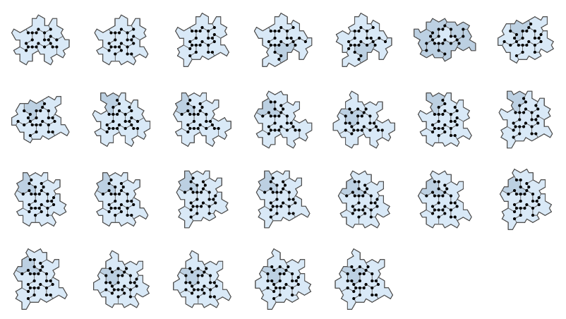

<h2>RL0.0 Hat Completions</h2>

<em>Figure: Welcome to Run Level 0.0, Hat vertex figures and their constellations.</em>

<h2>RL0.x Optimized Eliminations</h2>

<em>Figure: Booting through 0.x efficiency surfaces.</em>

<h2>RL1.0 Valid surrounds of one central tile</h2>

<em>Figure: Run Level 1.0 attained, (the?) 26 hexagonal pre-images.</em>

