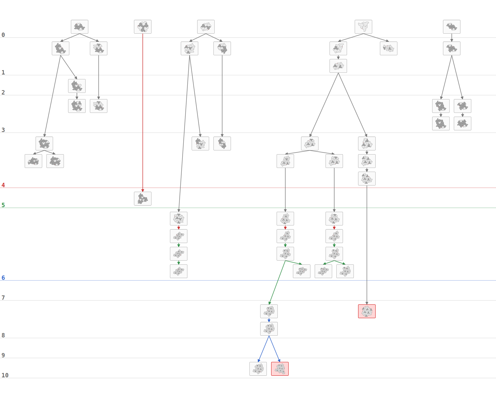
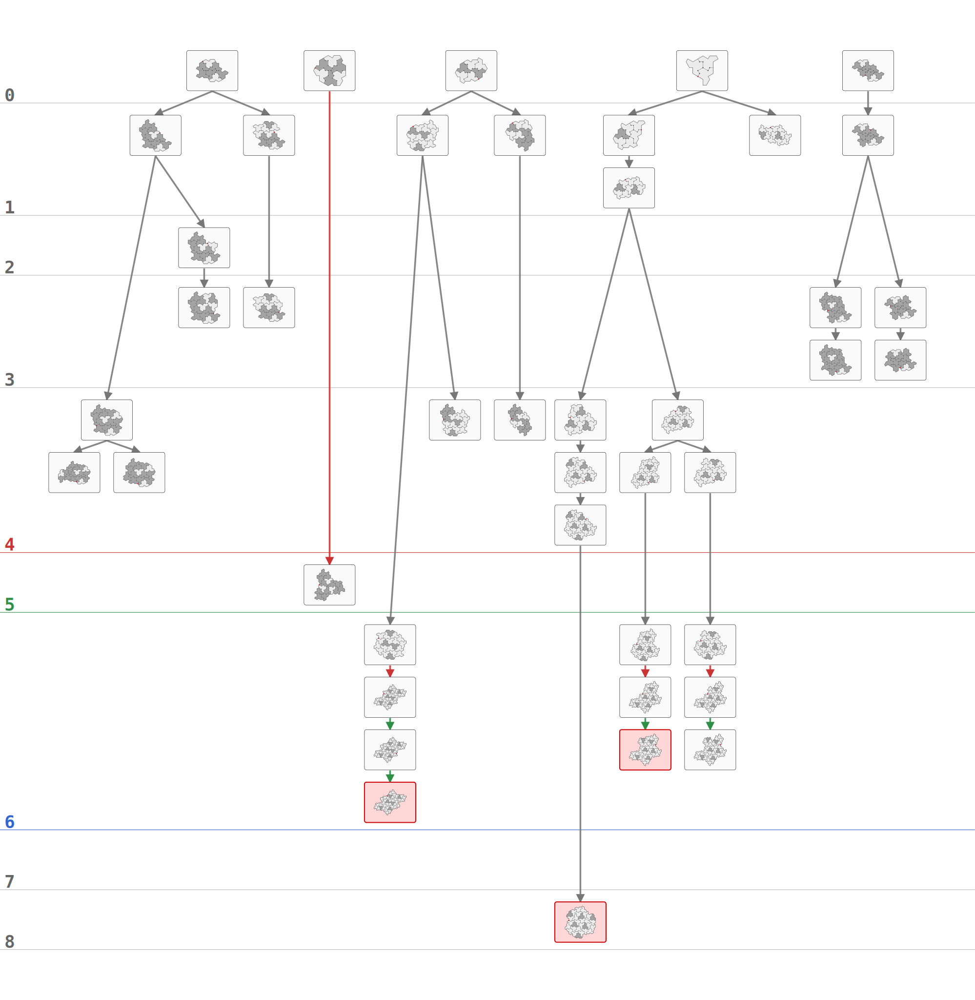
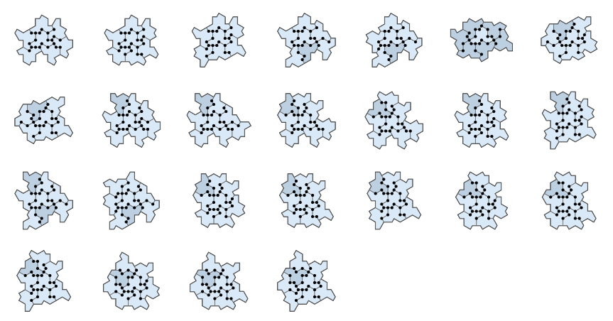
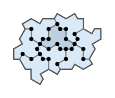
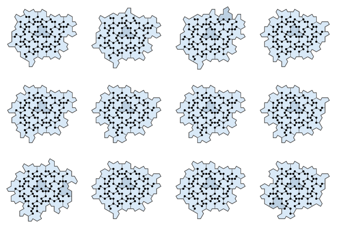
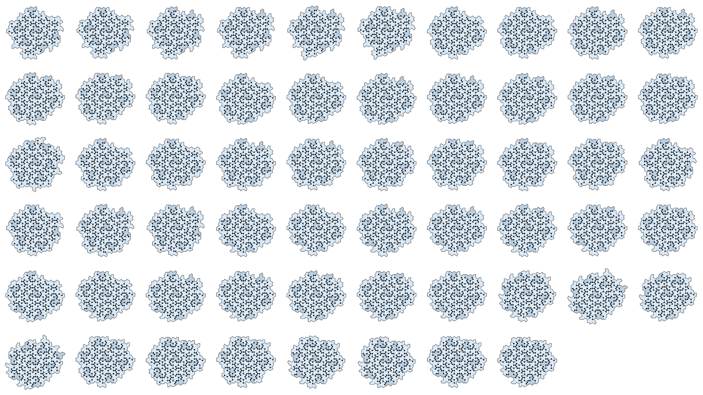

<h1>Instantiation</h1>

If you're interested in visual data about the hat tiling, you've come to the 
right place. In the PolyformTown/ directory type: 

```bash
make boot
```
This launches the boot loader, goes through a sequence of four or five run levels,
generating data needed to generate more data and finally figures. We have a nice 
splash screen that was drawn by Harm.On.ica, the lead research programmer (not 
just a clone of Open AI's Chat GPT 5.5, thank you very much!) 


Hat Town boot splash:

<pre style="background:#0b0d10; padding:1em; overflow-x:auto; line-height:1.0; font-family:monospace; font-size:12px;">
<span style="color:#40aef0">                                                                                </span>
<span style="color:#40aef0">                                                                                </span>
<span style="color:#40aef0">             </span><span style="color:#f4f6f0">@@@@</span><span style="color:#40aef0">  </span><span style="color:#f4f6f0">@</span><span style="color:#40aef0">              </span><span style="color:#d3c68a">==</span><span style="color:#e8bc35">TN</span><span style="color:#18539d">MT</span><span style="color:#40aef0">                                        </span>
<span style="color:#40aef0">                               </span><span style="color:#d3c68a">==</span><span style="color:#e8bc35">NMTTN</span><span style="color:#18539d">MTMN</span><span style="color:#3a8e43">Y</span><span style="color:#40aef0">                  </span><span style="color:#f4f6f0">@@@@</span><span style="color:#40aef0">               </span>
<span style="color:#40aef0">                           </span><span style="color:#d3c68a">==</span><span style="color:#e8bc35">M</span><span style="color:#18539d">M</span><span style="color:#d3c68a">=</span><span style="color:#e8bc35">NNMTT</span><span style="color:#3a8e43">.</span><span style="color:#0e4c48">;</span><span style="color:#18539d">T</span><span style="color:#40aef0">    </span><span style="color:#3a8e43">^</span><span style="color:#40aef0">               </span><span style="color:#f4f6f0">@@@@@@@</span><span style="color:#40aef0">             </span>
<span style="color:#40aef0">        </span><span style="color:#f4f6f0">@@@</span><span style="color:#40aef0">               </span><span style="color:#d3c68a">=</span><span style="color:#e8bc35">NNM</span><span style="color:#18539d">M</span><span style="color:#d3c68a">=</span><span style="color:#e8bc35">NNMT</span><span style="color:#3a8e43">Y^.V</span><span style="color:#40aef0"> </span><span style="color:#3a8e43">^</span><span style="color:#d23e2a">&lt;A&gt;</span><span style="color:#3a8e43">^.VY</span><span style="color:#18539d">T</span><span style="color:#40aef0">       </span><span style="color:#f4f6f0">@@@@</span><span style="color:#40aef0">    </span><span style="color:#f4f6f0">@@</span><span style="color:#40aef0"> </span><span style="color:#f4f6f0">@@@</span><span style="color:#40aef0">         </span>
<span style="color:#40aef0">    </span><span style="color:#f4f6f0">@@</span><span style="color:#40aef0"> </span><span style="color:#f4f6f0">@@@@@</span><span style="color:#40aef0"> </span><span style="color:#f4f6f0">@</span><span style="color:#40aef0">            </span><span style="color:#d3c68a">=</span><span style="color:#e8bc35">NNM</span><span style="color:#18539d">MN</span><span style="color:#e8bc35">NNMTTNN</span><span style="color:#3a8e43">.</span><span style="color:#e8bc35">T</span><span style="color:#d3c68a">==</span><span style="color:#3a8e43">.</span><span style="color:#18539d">TMNNMTMN</span><span style="color:#40aef0">                            </span>
<span style="color:#40aef0">   </span><span style="color:#f4f6f0">@@@@</span><span style="color:#40aef0">    </span><span style="color:#f4f6f0">@@@</span><span style="color:#40aef0">            </span><span style="color:#d3c68a">=</span><span style="color:#e8bc35">N</span><span style="color:#d3c68a">=</span><span style="color:#18539d">TMN</span><span style="color:#3a8e43">.</span><span style="color:#e8bc35">NMTTNN</span><span style="color:#d3c68a">==</span><span style="color:#3a8e43">V</span><span style="color:#18539d">NMTMNNMTMN</span><span style="color:#40aef0">    </span><span style="color:#f4f6f0">@@</span><span style="color:#40aef0">                      </span>
<span style="color:#40aef0">                          </span><span style="color:#d3c68a">=</span><span style="color:#3a8e43">Y</span><span style="color:#18539d">MTMNN</span><span style="color:#3a8e43">.</span><span style="color:#e8bc35">MTTN</span><span style="color:#d3c68a">=</span><span style="color:#3a8e43">Y^</span><span style="color:#0e4c48">,</span><span style="color:#18539d">NMTMNNMTMN</span><span style="color:#40aef0">                     </span><span style="color:#f4f6f0">@@</span><span style="color:#40aef0">     </span>
<span style="color:#40aef0">                  </span><span style="color:#f4f6f0">@@@</span><span style="color:#40aef0">     </span><span style="color:#3a8e43">.V</span><span style="color:#18539d">M</span><span style="color:#40aef0">   </span><span style="color:#0e4c48">.</span><span style="color:#18539d">M</span><span style="color:#3a8e43">.VY</span><span style="color:#e8bc35">NN</span><span style="color:#d3c68a">==</span><span style="color:#3a8e43">^.V</span><span style="color:#0e4c48">.</span><span style="color:#18539d">MNNMTMNN</span><span style="color:#40aef0">                  </span><span style="color:#f4f6f0">@@</span><span style="color:#40aef0">  </span><span style="color:#f4f6f0">@</span><span style="color:#40aef0">    </span>
<span style="color:#40aef0">                    </span><span style="color:#d23e2a">&lt;A</span><span style="color:#40aef0">   </span><span style="color:#3a8e43">Y^</span><span style="color:#e8bc35">NNMTT</span><span style="color:#3a8e43">VY^.V</span><span style="color:#0e4c48">;</span><span style="color:#3a8e43">^</span><span style="color:#e8bc35">MTT</span><span style="color:#d3c68a">=</span><span style="color:#3a8e43">.V</span><span style="color:#0e4c48">;</span><span style="color:#3a8e43">^</span><span style="color:#0e4c48">;</span><span style="color:#18539d">MTM</span><span style="color:#3a8e43">.</span><span style="color:#0e4c48">;</span><span style="color:#18539d">M</span><span style="color:#40aef0">              </span><span style="color:#f4f6f0">@@</span><span style="color:#40aef0">          </span>
<span style="color:#40aef0">               </span><span style="color:#d3c68a">========</span><span style="color:#e8bc35">N</span><span style="color:#3a8e43">.V</span><span style="color:#e8bc35">TNNMT</span><span style="color:#3a8e43">^</span><span style="color:#18539d">NMTMNNMT</span><span style="color:#e8bc35">TT</span><span style="color:#18539d">NM</span><span style="color:#3a8e43">.</span><span style="color:#d3c68a">=</span><span style="color:#3a8e43">Y</span><span style="color:#0e4c48">,,,</span><span style="color:#3a8e43">Y</span><span style="color:#40aef0">  </span><span style="color:#0e4c48">,,</span><span style="color:#3a8e43">^</span><span style="color:#0e4c48">,</span><span style="color:#18539d">N</span><span style="color:#40aef0">                      </span>
<span style="color:#40aef0">      </span><span style="color:#f4f6f0">@</span><span style="color:#40aef0">       </span><span style="color:#d3c68a">=</span><span style="color:#e8bc35">TTNN</span><span style="color:#18539d">TMNN</span><span style="color:#d3c68a">==</span><span style="color:#3a8e43">.VY</span><span style="color:#e8bc35">NMT</span><span style="color:#3a8e43">Y</span><span style="color:#18539d">NMTMNNMTMN</span><span style="color:#e8bc35">N</span><span style="color:#3a8e43">Y^.</span><span style="color:#d3c68a">==</span><span style="color:#e8bc35">NMTT</span><span style="color:#d3c68a">=</span><span style="color:#d23e2a">A&gt;</span><span style="color:#3a8e43">Y</span><span style="color:#18539d">NNMT</span><span style="color:#40aef0">                    </span>
<span style="color:#40aef0">             </span><span style="color:#d3c68a">=</span><span style="color:#e8bc35">MTT</span><span style="color:#d3c68a">=</span><span style="color:#18539d">MTM</span><span style="color:#3a8e43">^.</span><span style="color:#d3c68a">==</span><span style="color:#3a8e43">^.V</span><span style="color:#0e4c48">;</span><span style="color:#3a8e43">^</span><span style="color:#d3c68a">=</span><span style="color:#18539d">NNMTMNNMTMN</span><span style="color:#d3c68a">===</span><span style="color:#3a8e43">^.VY</span><span style="color:#e8bc35">MTTN</span><span style="color:#18539d">MTMNNMTMNNM</span><span style="color:#40aef0">           </span><span style="color:#f4f6f0">@@</span><span style="color:#40aef0">   </span>
<span style="color:#40aef0">            </span><span style="color:#3a8e43">VY</span><span style="color:#0e4c48">,</span><span style="color:#3a8e43">.V</span><span style="color:#18539d">NMT</span><span style="color:#0e4c48">,</span><span style="color:#3a8e43">Y</span><span style="color:#d3c68a">=</span><span style="color:#e8bc35">NMT</span><span style="color:#18539d">NNMTMNNMTMN</span><span style="color:#3a8e43">Y^.V</span><span style="color:#d3c68a">=</span><span style="color:#e8bc35">N</span><span style="color:#3a8e43">.</span><span style="color:#e8bc35">MT</span><span style="color:#3a8e43">^.V</span><span style="color:#0e4c48">,</span><span style="color:#3a8e43">^</span><span style="color:#e8bc35">TN</span><span style="color:#18539d">MTMNNMTMNNMTMNN</span><span style="color:#40aef0">            </span>
<span style="color:#40aef0">    </span><span style="color:#3a8e43">.V</span><span style="color:#18539d">N</span><span style="color:#40aef0">     </span><span style="color:#18539d">NM</span><span style="color:#0e4c48">...</span><span style="color:#18539d">N</span><span style="color:#0e4c48">.</span><span style="color:#3a8e43">^</span><span style="color:#0e4c48">.</span><span style="color:#3a8e43">V</span><span style="color:#e8bc35">NNMT</span><span style="color:#3a8e43">Y</span><span style="color:#0e4c48">.</span><span style="color:#3a8e43">.VY</span><span style="color:#0e4c48">.</span><span style="color:#18539d">N</span><span style="color:#3a8e43">V</span><span style="color:#40aef0">  </span><span style="color:#0e4c48">.</span><span style="color:#3a8e43">V</span><span style="color:#d3c68a">==</span><span style="color:#3a8e43">.V</span><span style="color:#e8bc35">NNMT</span><span style="color:#d3c68a">=</span><span style="color:#18539d">NMTMNN</span><span style="color:#3a8e43">V</span><span style="color:#18539d">TMNNMT</span><span style="color:#0e4c48">.</span><span style="color:#3a8e43">V</span><span style="color:#0e4c48">..</span><span style="color:#18539d">TM</span><span style="color:#3a8e43">Y^.</span><span style="color:#d3c68a">==</span><span style="color:#40aef0">         </span>
<span style="color:#40aef0">  </span><span style="color:#3a8e43">VY^</span><span style="color:#0e4c48">;;</span><span style="color:#3a8e43">Y</span><span style="color:#18539d">M</span><span style="color:#40aef0">   </span><span style="color:#3a8e43">^.VY^</span><span style="color:#0e4c48">;;;</span><span style="color:#3a8e43">^</span><span style="color:#e8bc35">TN</span><span style="color:#3a8e43">Y^.VY</span><span style="color:#0e4c48">;;</span><span style="color:#3a8e43">VY</span><span style="color:#d3c68a">=</span><span style="color:#e8bc35">NMT</span><span style="color:#3a8e43">^.VY</span><span style="color:#0e4c48">;;</span><span style="color:#3a8e43">V</span><span style="color:#e8bc35">NM</span><span style="color:#3a8e43">.VY^</span><span style="color:#0e4c48">;</span><span style="color:#18539d">MNNM</span><span style="color:#d3c68a">=</span><span style="color:#3a8e43">Y</span><span style="color:#0e4c48">;</span><span style="color:#40aef0">  </span><span style="color:#0e4c48">;;</span><span style="color:#3a8e43">.VY^</span><span style="color:#e8bc35">TTN</span><span style="color:#3a8e43">^</span><span style="color:#18539d">TMN</span><span style="color:#40aef0">    </span><span style="color:#3a8e43">^</span><span style="color:#0e4c48">;</span><span style="color:#40aef0">  </span>
<span style="color:#3a8e43">Y^.V</span><span style="color:#0e4c48">,,,,,</span><span style="color:#18539d">T</span><span style="color:#3a8e43">.V</span><span style="color:#e8bc35">NNM</span><span style="color:#3a8e43">VY^.</span><span style="color:#d3c68a">=</span><span style="color:#e8bc35">T</span><span style="color:#3a8e43">^.</span><span style="color:#0e4c48">,,,,,,,</span><span style="color:#3a8e43">.V</span><span style="color:#e8bc35">NN</span><span style="color:#d23e2a">&lt;A</span><span style="color:#18539d">NN</span><span style="color:#0e4c48">,</span><span style="color:#3a8e43">V</span><span style="color:#0e4c48">,,,,,,,,,,,,,</span><span style="color:#e8bc35">NMT</span><span style="color:#3a8e43">Y</span><span style="color:#d3c68a">=</span><span style="color:#3a8e43">.VY^</span><span style="color:#0e4c48">,,</span><span style="color:#3a8e43">Y</span><span style="color:#e8bc35">TT</span><span style="color:#18539d">NM</span><span style="color:#0e4c48">,</span><span style="color:#18539d">M</span><span style="color:#40aef0">  </span><span style="color:#3a8e43">^</span><span style="color:#18539d">TM</span><span style="color:#0e4c48">,,,</span><span style="color:#18539d">T</span>
<span style="color:#0e4c48">..</span><span style="color:#3a8e43">^.</span><span style="color:#0e4c48">...</span><span style="color:#3a8e43">.VY^.VY^</span><span style="color:#0e4c48">.</span><span style="color:#3a8e43">VY</span><span style="color:#d3c68a">=</span><span style="color:#3a8e43">.</span><span style="color:#0e4c48">..</span><span style="color:#3a8e43">^</span><span style="color:#0e4c48">..</span><span style="color:#3a8e43">Y^.</span><span style="color:#0e4c48">....</span><span style="color:#3a8e43">V</span><span style="color:#e8bc35">N</span><span style="color:#3a8e43">^</span><span style="color:#0e4c48">......</span><span style="color:#3a8e43">Y</span><span style="color:#0e4c48">......</span><span style="color:#3a8e43">VY</span><span style="color:#0e4c48">....</span><span style="color:#d3c68a">==</span><span style="color:#3a8e43">VY</span><span style="color:#0e4c48">....</span><span style="color:#3a8e43">^.</span><span style="color:#0e4c48">..</span><span style="color:#3a8e43">^.</span><span style="color:#0e4c48">.</span><span style="color:#3a8e43">Y</span><span style="color:#0e4c48">..</span><span style="color:#18539d">N</span><span style="color:#0e4c48">.......</span>
<span style="color:#0e4c48">;;;;;;</span><span style="color:#3a8e43">Y^</span><span style="color:#0e4c48">;</span><span style="color:#3a8e43">VY</span><span style="color:#0e4c48">;;;;;</span><span style="color:#3a8e43">.V</span><span style="color:#0e4c48">;</span><span style="color:#3a8e43">^.VY</span><span style="color:#0e4c48">;;</span><span style="color:#3a8e43">V</span><span style="color:#0e4c48">;;;;</span><span style="color:#3a8e43">Y^</span><span style="color:#0e4c48">;;;;;</span><span style="color:#3a8e43">VY^</span><span style="color:#0e4c48">;;;;;;;</span><span style="color:#3a8e43">^</span><span style="color:#0e4c48">;;;;</span><span style="color:#3a8e43">.VY</span><span style="color:#0e4c48">;;</span><span style="color:#3a8e43">V</span><span style="color:#0e4c48">;;;</span><span style="color:#3a8e43">VY</span><span style="color:#0e4c48">;;;;</span><span style="color:#3a8e43">^.V</span><span style="color:#0e4c48">;;;;</span><span style="color:#3a8e43">Y^.</span><span style="color:#0e4c48">;;;</span>
<span style="color:#0e4c48">^</span><span style="color:#e8bc35">Willkommen in Hat Town,</span><span style="color:#0e4c48">^Y</span><span style="color:#3a8e43">V.</span><span style="color:#0e4c48">^YV.^Y,</span><span style="color:#3a8e43">Y^.VY^.</span><span style="color:#0e4c48">,,,,,,,</span><span style="color:#3a8e43">.V</span><span style="color:#0e4c48">,^YV</span><span style="color:#3a8e43">.^YV</span><span style="color:#0e4c48">.^YV.^</span><span style="color:#3a8e43">Y</span><span style="color:#0e4c48">V.^YV.</span><span style="color:#3a8e43">^Y</span><span style="color:#0e4c48">V.^YV.</span>
<span style="color:#0e4c48">V</span><span style="color:#3a8e43">^YV.</span><span style="color:#e8bc35">Ein Stein, Klippentrauben.</span><span style="color:#0e4c48">YV.</span><span style="color:#3a8e43">.VY^.VY^.V</span><span style="color:#0e4c48">.</span><span style="color:#3a8e43">^.</span><span style="color:#0e4c48">.....V.^</span><span style="color:#18539d">MAINTAIN</span><span style="color:#3a8e43">YV.</span><span style="color:#0e4c48">^YV.^</span><span style="color:#3a8e43">YV</span><span style="color:#0e4c48">.^YV.^Y</span>
<span style="color:#0e4c48">;;;;;;</span><span style="color:#3a8e43">^.V</span><span style="color:#0e4c48">;</span><span style="color:#3a8e43">^</span><span style="color:#0e4c48">;;;;</span><span style="color:#3a8e43">.</span><span style="color:#0e4c48">;;;;;</span><span style="color:#3a8e43">Y^.</span><span style="color:#0e4c48">;;;;;</span><span style="color:#3a8e43">Y^</span><span style="color:#0e4c48">;</span><span style="color:#3a8e43">VY^.V</span><span style="color:#0e4c48">;;;;</span><span style="color:#3a8e43">Y^.VY</span><span style="color:#0e4c48">;;;;;</span><span style="color:#3a8e43">.^YV^YV.</span><span style="color:#18539d">MONTAGNE</span><span style="color:#0e4c48">.</span><span style="color:#3a8e43">^YV</span><span style="color:#0e4c48">.^YV</span><span style="color:#3a8e43">.^</span><span style="color:#0e4c48">YV.</span>
<span style="color:#0e4c48">,,,,,,,,,,,,,,,,,,,,,,,,,,,,,,,,,,,,,,,,,,,,,,,,,,,,V.</span><span style="color:#3a8e43">Harm.On.ica, Bradley Klee</span><span style="color:#0e4c48">Y</span>
</pre>


Data generated during boot process is nice food for a Large Language Model 
or any other text transformer, but humans will want SVG images. Just type: 


```bash
make figures
```

The figures can then be found in the img/ directory. Latest versions are 
included below. 


<h1>Scaleable Figures</h1>

<h2>RL0.0 Hat Completions</h2>


<p><em>Figure: Welcome to Run Level 0.0, Hat vertex figures and their constellations.</em></p>


<h2>RL0.x Optimized Eliminations (bounded)</h2>



<p><em>Figure: A failed attempt bound at |constellation| = 256.</em></p>

<h2>RL0.x Optimized Eliminations (full)</h2>



<p><em>Figure: Booting through 0.x efficiency surfaces.</em></p>

 
<h2>RL1 validated surrounds of one central tile</h2>



<p><em>Figure: Run Level 1 attained, (how many?) hexagonal pre-images.</em></p>


<h2>Odd one out becomes a supertile</h2>



<p><em>Figure: Supertile after forced completion tiles added.</em></p>


<h2>RL2 validated surrounds of one supertile</h2>



<p><em>Figure: structure emerging?</em></p>


<h2>RL3 validated 2-surrounds of one supertile</h2>



<p><em>Figure: almost good enough for hexagon extraction?</em></p>
